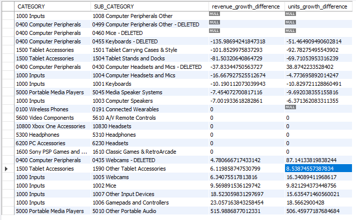

<h1>Case Study</h1>

**Q1- Identify the most expensive SKU, on average, over the entire time period.**</br>
Ans - </br>
       *Assumptions*</br>
* ORDERED_REVENUE and ORDERED_UNITS are positive values.</br>
</br>

*SQL Code*</br>
```sql
SELECT SKU_NAME, AVG(ORDERED_REVENUE / ORDERED_UNITS) AS avg_price_per_unit
FROM sales_data
WHERE ORDERED_UNITS > 0  --to avoid division by zero
GROUP BY SKU_NAME
ORDER BY avg_price_per_unit DESC
LIMIT 1;
```
</br>

*Explaination*</br>
* AVG(ORDERED_REVENUE / ORDERED_UNITS): This calculates the average price per unit for each SKU.</br>
* WHERE ORDERED_UNITS > 0: Ensures no division by zero occurs.</br>
* GROUP BY SKU_NAME: Groups the result by the SKU to calculate the average price for each SKU.</br>
* ORDER BY avg_price_per_unit DESC: Sorts the SKUs by the average price per unit in descending  order to get the most expensive one at the top.</br>
* LIMIT 1: Limits the result to the SKU with the highest average price.</br>

*Result*</br>


</br>
</br>
<hr>

**Q2- What % of SKUs have generated some revenue in this time period?**</br>
Ans - </br>
       *Assumptions*</br>
* SKUs with zero or negative revenue are considered as not generating revenue.</br>
* The time period is implicitly defined by the FEED_DATE column in the table.</br>
</br>

*SQL Code*</br>
```sql
SELECT 
    (COUNT(DISTINCT CASE WHEN ORDERED_REVENUE > 0 THEN SKU_NAME END) / COUNT(DISTINCT SKU_NAME)) * 100 AS revenue_generating_percentage
FROM sales_data;
```

*Explaination*</br>
*Identify SKUs with Revenue:</br>
From the sales table, filter SKUs where ORDERED_REVENUE > 0.</br>

*Total Unique SKUs:</br>
Count the total number of unique SKU_NAME in the table, regardless of whether they generated revenue or not.</br>

*Calculate Percentage:</br>
The formula to calculate the percentage is:
Percentage=(SKUs with revenue/Total SKUs)×100


*Result*</br>

</br>
</br>


**Q2- (brownie points - can you identify SKUs that stopped selling completely after July?)**</br>
Ans - </br>
       *Assumptions*</br>
* The cutoff date for "after July" is considered as starting from July 1st ('2023-07-01').</br>
* SKUs with zero revenue after July are considered as not selling.</br>
</br>

*SQL Code*</br>
```sql
 -- SKUs with sales before July
WITH Sales_Before_July AS (
    SELECT DISTINCT SKU_NAME
    FROM sales_data
    WHERE FEED_DATE < '2023-07-01'
    AND ORDERED_REVENUE > 0
),

-- SKUs with sales after July
Sales_After_July AS (
    SELECT DISTINCT SKU_NAME
    FROM sales_data
    WHERE FEED_DATE >= '2023-07-01'
    AND ORDERED_REVENUE > 0
)

-- Find SKUs that stopped selling after July
SELECT SKU_NAME
FROM Sales_Before_July
WHERE SKU_NAME NOT IN (SELECT SKU_NAME FROM Sales_After_July);
```
</br>

*Explaination*</br>
*Split Data by Date:</br>
We need to check for SKUs that had ORDERED_REVENUE > 0 before July and no sales (ORDERED_REVENUE = 0) after July.</br>

*Identify SKUs with Sales Before July:</br>
First, identify all SKUs with ORDERED_REVENUE > 0 before July 2023</br>

*Check for No Sales After July:</br>
Then, for those SKUs, check if they had no sales after July (i.e., ORDERED_REVENUE = 0 for all rows after '2023-07-01').</br>

*Result*</br>
..contd
</br>
</br>

<hr>
**Q3-  Somewhere in this timeframe, there was a Sale Event. Identify the dates.**</br>
Ans - </br>
       *Assumptions*</br>
* A sale event is defined as days where total sales (either revenue or units sold) are at least 50% higher than the average.</br>
* The timeframe is defined by the data in the FEED_DATE column.</br>
</br>

*SQL Code*</br>
```sql
 SELECT FEED_DATE,
       SUM(ORDERED_REVENUE) AS total_revenue,
       SUM(ORDERED_UNITS) AS total_units
FROM sales_data
GROUP BY FEED_DATE
HAVING SUM(ORDERED_REVENUE) > (
    SELECT AVG(daily_revenue) * 1.5
    FROM (
       SELECT FEED_DATE, SUM(ORDERED_REVENUE) AS daily_revenue
        FROM sales_data
        GROUP BY FEED_DATE
    ) AS daily_totals
)
ORDER BY total_revenue DESC;
```
</br>
</br>

*Explaination*</br>
*The query finds dates where the total revenue is greater than 1.5 times the average daily revenue.</br>

*It then returns the FEED_DATE, total revenue, and total units for those dates.</br>

*The result is ordered by the total revenue in descending order to highlight the most significant revenue days first.</br>

*Result*</br>

</br>
</br>
<hr>

**Q4-Does having a sale event cannibalize sales in the immediate aftermath? Highlighting a few examples would suffice.**</br>
Ans - </br>
       *Assumptions*</br>
* From our analysis in Question 3, we found that the one of the sale event happened between July 15, 2019 and July 16, 2019.</br>
* The pre-sale and post-sale periods are both 7 days. We can adjust this interval as needed.</br>
</br>

*SQL Code*</br>
```sql
-- Pre-sale period: 7 days before the sale event
WITH Pre_Sale AS (
    SELECT 
        AVG(ORDERED_REVENUE) AS avg_pre_sale_revenue, 
        AVG(ORDERED_UNITS) AS avg_pre_sale_units
    FROM sales_data
    WHERE FEED_DATE BETWEEN DATE_SUB('2019-07-08', INTERVAL 7 DAY) 
                        AND DATE_SUB('2019-07-14', INTERVAL 1 DAY)
),
-- Post-sale period: 7 days after the sale event
Post_Sale AS (
    SELECT 
        AVG(ORDERED_REVENUE) AS avg_post_sale_revenue, 
        AVG(ORDERED_UNITS) AS avg_post_sale_units
    FROM sales_data
    WHERE FEED_DATE BETWEEN DATE_ADD('2019-07-17', INTERVAL 1 DAY) 
                        AND DATE_ADD('2019-07-24', INTERVAL 7 DAY)
)
-- Compare Pre-sale and Post-sale sales
SELECT 
    PR.avg_pre_sale_revenue, 
    PS.avg_post_sale_revenue, 
    ((PS.avg_post_sale_revenue / PR.avg_pre_sale_revenue) * 100) - 100 AS revenue_change_percentage,
    PR.avg_pre_sale_units, 
    PS.avg_post_sale_units,
    ((PS.avg_post_sale_units / PR.avg_pre_sale_units) * 100) - 100 AS units_change_percentage
FROM Pre_Sale PR, Post_Sale PS;
```
</br>
</br>

*Explaination*</br>
*Post-Sale Value: The average value (either revenue or units sold) during the post-sale period (e.g., 7 days after the sale).</br>

*Pre-Sale Value: The average value (either revenue or units sold) during the pre-sale period (e.g., 7 days before the sale).</br>

*Subtracting 100: Since a ratio of 1 (or 100%) would mean that the post-sale and pre-sale values are exactly the same, subtracting 100 allows us to focus on the percentage increase or decrease relative to the pre-sale period:</br>

  -If the result is positive, it indicates a percentage increase (post-sale > pre-sale).</br>
  -If the result is negative, it indicates a percentage decrease (post-sale < pre-sale).</br>

*Result*</br>

</br>
</br>


**(brownie points - determine a statistical metric to prove/disprove this)**</br>
Revenue Change:</br>
Pre-Sale Revenue: 1978.19</br>
Post-Sale Revenue: 2181.21</br>
Using the formula:</br>

Revenue Change Percentage</br>
=((2181.21/1978.19)×100)−100 = 10.26%</br>
This means that post-sale revenue is 10.26% higher than pre-sale revenue.</br>

Units Change:</br>
Pre-Sale Units Sold: 45.60</br>
Post-Sale Units Sold: 52.55</br>
Using the formula:</br>

Units Change Percentage</br>
=((52.55/45.60)×100)−100=15.25%</br>

This means that post-sale units sold is 15.25% higher than pre-sale units sold.</br>

**Conclusion:**</br>
No Cannibalization: The increase in both revenue (+10.26%) and units sold (+15.25%) indicates that there was no evidence of sales cannibalization after the sale event. In fact, the sales performance seems to have improved in the period immediately following the sale event.</br>

Possible Positive Impact: The sale event may have had a positive lingering effect, leading to higher sales afterward (potentially due to residual customer interest, marketing efforts, or other external factors).</br>

</br>
</br>
<hr>


**Q5-In each category, find the subcategory that has grown slowest relative to the category it is present in. If you were handling the entire portfolio, which of these subcategories would you be most concerned with?**</br>
Ans - </br>
       *Assumptions*</br>
* Initial Period: May 1, 2019, to June 30, 2019 (before the potential mid-point)
  Later Period: July 1, 2019, to August 31, 2019</br>
* We’ll assume growth is measured based on the difference in total revenue over time.</br>
</br>

*SQL Code*</br>
```sql
-- Step 1: Calculate the total ordered revenue for each category in the initial period and the later period
WITH Category_Sales AS (
    SELECT 
        CATEGORY,
        SUM(CASE WHEN FEED_DATE BETWEEN '2019-05-01' AND '2019-06-30' THEN ORDERED_REVENUE ELSE 0 END) AS category_revenue_start,
        SUM(CASE WHEN FEED_DATE BETWEEN '2019-07-01' AND '2019-08-31' THEN ORDERED_REVENUE ELSE 0 END) AS category_revenue_end,
        SUM(CASE WHEN FEED_DATE BETWEEN '2019-05-01' AND '2019-06-30' THEN ORDERED_UNITS ELSE 0 END) AS category_units_start,
        SUM(CASE WHEN FEED_DATE BETWEEN '2019-07-01' AND '2019-08-31' THEN ORDERED_UNITS ELSE 0 END) AS category_units_end
    FROM sales_data
    GROUP BY CATEGORY
),
-- Step 2: Calculate the total ordered revenue for each subcategory in the initial period and the later period
Subcategory_Sales AS (
    SELECT 
        CATEGORY, 
        SUB_CATEGORY,
        SUM(CASE WHEN FEED_DATE BETWEEN '2019-05-01' AND '2019-06-30' THEN ORDERED_REVENUE ELSE 0 END) AS subcategory_revenue_start,
        SUM(CASE WHEN FEED_DATE BETWEEN '2019-07-01' AND '2019-08-31' THEN ORDERED_REVENUE ELSE 0 END) AS subcategory_revenue_end,
        SUM(CASE WHEN FEED_DATE BETWEEN '2019-05-01' AND '2019-06-30' THEN ORDERED_UNITS ELSE 0 END) AS subcategory_units_start,
        SUM(CASE WHEN FEED_DATE BETWEEN '2019-07-01' AND '2019-08-31' THEN ORDERED_UNITS ELSE 0 END) AS subcategory_units_end
    FROM sales_data
    GROUP BY CATEGORY, SUB_CATEGORY
),
-- Step 3: Calculate the growth rates for categories and subcategories
Category_Growth AS (
    SELECT 
        CATEGORY,
        ((category_revenue_end - category_revenue_start) / NULLIF(category_revenue_start, 0)) * 100 AS category_revenue_growth,
        ((category_units_end - category_units_start) / NULLIF(category_units_start, 0)) * 100 AS category_units_growth
    FROM Category_Sales
),
Subcategory_Growth AS (
    SELECT 
        CATEGORY, 
        SUB_CATEGORY,
        ((subcategory_revenue_end - subcategory_revenue_start) / NULLIF(subcategory_revenue_start, 0)) * 100 AS subcategory_revenue_growth,
        ((subcategory_units_end - subcategory_units_start) / NULLIF(subcategory_units_start, 0)) * 100 AS subcategory_units_growth
    FROM Subcategory_Sales
),
-- Step 4: Compare subcategory growth to category growth and find the slowest growing subcategory in each category
Relative_Growth AS (
    SELECT 
        S.CATEGORY,
        S.SUB_CATEGORY,
        S.subcategory_revenue_growth,
        S.subcategory_units_growth,
        C.category_revenue_growth,
        C.category_units_growth,
        (S.subcategory_revenue_growth - C.category_revenue_growth) AS revenue_growth_difference,
        (S.subcategory_units_growth - C.category_units_growth) AS units_growth_difference
    FROM Subcategory_Growth S
    JOIN Category_Growth C ON S.CATEGORY = C.CATEGORY
)
-- Step 5: Find the slowest growing subcategory in each category
SELECT 
    CATEGORY, 
    SUB_CATEGORY,
    revenue_growth_difference,
    units_growth_difference
FROM Relative_Growth
ORDER BY revenue_growth_difference ASC, units_growth_difference ASC;
```

</br>
</br>

*Explaination*</br>
*Category and Subcategory Growth: We calculate the total revenue (ORDERED_REVENUE) and units (ORDERED_UNITS) for both categories and subcategories in two periods—start_date to mid_date (initial period) and mid_date to end_date (later period).</br>

*Growth Calculation: We calculate the percentage growth for both the categories and subcategories in revenue and units using the formula:</br>

Growth = ((End Value − Start Value)/ Start Value) × 100</br>

*Comparison: We compare the growth of each subcategory to its parent category by subtracting the category's growth from the subcategory's growth:</br>

-revenue_growth_difference: How much the subcategory's revenue growth lags behind the category.</br>
-units_growth_difference: How much the subcategory's units growth lags behind the category.</br>


*Result*</br>

</br>
</br>


**Subcategories of Concern**</br>
</br>
*0400 Computer Peripherals</br>
Subcategory: 0460 Mice - DELETED</br>
Reason for Concern: This subcategory has a significant negative growth rate in both revenue and units sold. The designation "DELETED" suggests that this product line is no longer actively promoted, indicating potential loss of market presence and revenue.</br>

*1500 Tablet Accessories</br>
Subcategory: 1501 Tablet Carrying Cases & Style</br>
Reason for Concern: This subcategory shows a negative growth in both revenue and unit sales, which could indicate waning consumer interest or oversaturation in the market for tablet accessories.

*1000 Inputs</br>
Subcategory: 1004 Computer Headsets and Mics</br>
Reason for Concern: The slight negative growth could suggest issues with either product quality or competition, especially since headsets and microphones are crucial for remote work and gaming, which are rapidly growing markets.</br>

*5000 Portable Media Players</br>
Subcategory: 5045 Media Speaker Systems</br>
Reason for Concern: Despite having some positive sales, the growth is minimal. Given the rise in streaming services and wireless audio devices, this subcategory might need reevaluation of its product offerings or marketing strategies.</br>

</br>
</br>
<hr>

**Q6- Highlight any anomalies/mismatches in the data that you see, if any. (In terms of data quality issues)**</br>
Ans - </br>
 Analyzing the provided data from both the Sales and Glance tables can reveal potential anomalies or mismatches that may indicate data quality issues. Here are some observations:</br>

**1- Zero Sales with Non-Zero Views:** </br>
*Observation: In the Sales table, some SKUs show zero revenue and zero units sold, yet they might have non-zero views in the Glance table.</br>
*Implication: This mismatch could suggest that while there is interest in the products (as indicated by views), the sales data reflects either ineffective marketing or issues with product appeal, pricing, or availability.</br>

*SQL Code*</br>
```sql
SELECT 
    g.SKU_NAME, 
    g.FEED_DATE, 
    g.VIEWS, 
    g.UNITS 
FROM 
    glance.glance_views g
LEFT JOIN 
    sales.sales_data s ON g.SKU_NAME = s.SKU_NAME AND g.FEED_DATE = s.FEED_DATE
WHERE 
    s.ORDERED_REVENUE = 0 
    AND s.ORDERED_UNITS = 0 
    AND g.VIEWS > 0;
```
*Result*</br>
contd...
</br>
</br>

**2- Deleted Products:** </br>
*Observation: The presence of subcategories labeled as “DELETED” in the Sales table may indicate that these products should no longer be in the active sales records.</br>
*Implication: If these SKUs still appear in the sales analysis, it can lead to misleading conclusions about overall product performance and category growth.</br>

*SQL Code*</br>
```sql
SELECT 
    SKU_NAME, 
    SUB_CATEGORY 
FROM 
    sales.sales_data 
WHERE 
    SUB_CATEGORY LIKE '%DELETED%';
```
*Result*</br>
contd...
</br>
</br>

**3- Irregular Patterns in Views and Sales:** </br>
*Observation: If certain SKUs show spikes in views but not corresponding spikes in sales, this might indicate a conversion issue.</br>
*Implication: Analyzing user behavior may reveal reasons behind the drop-off, such as website navigation problems, unappealing product presentation, or competitive alternatives.</br>

*SQL Code*</br>
```sql
SELECT 
    g.SKU_NAME, 
    g.FEED_DATE, 
    g.VIEWS, 
    s.ORDERED_REVENUE 
FROM 
    glance.glance_view g
LEFT JOIN 
    sales.sales_data s ON g.SKU_NAME = s.SKU_NAME AND g.FEED_DATE = s.FEED_DATE
WHERE 
    g.VIEWS > 1000  -- or any threshold for high views
    AND (s.ORDERED_REVENUE IS NULL OR s.ORDERED_REVENUE < 100);  -- or low revenue

```
*Result*</br>
contd...
</br>
</br>
<hr>

**Q7- For SKU Name C120[H:8NV, discuss whether Unit Conversion (Units/Views) is affected by Average Selling Price.**</br>
Ans - </br>
       *Assumptions*</br>
*We assume that the sales data (ORDERED_REVENUE, ORDERED_UNITS) and the views data (glance_views.VIEWS) are accurate and correctly matched by FEED_DATE. Any discrepancies between the two datasets could lead to incorrect conclusions.</br>
*Constant Market Conditions: We assume that external market conditions, such as seasonality, competitor activity, and economic factors, remain relatively stable and do not significantly affect the relationship between Average Selling Price (ASP) and Unit Conversion.</br>
</br>

*SQL Code*</br>
```sql
SELECT 
    s.FEED_DATE,
    s.ORDERED_UNITS,
    s.ORDERED_REVENUE,
    g.VIEWS,
    (s.ORDERED_REVENUE / s.ORDERED_UNITS) AS ASP,
    (s.ORDERED_UNITS / g.VIEWS) AS UNIT_CONVERSION
FROM 
    sales.sales_data s
JOIN 
    glance.glance_views g ON s.SKU_NAME = g.SKU_NAME AND s.FEED_DATE = g.FEED_DATE
WHERE 
    s.SKU_NAME = 'C120[H:8NV'
ORDER BY 
    s.FEED_DATE;
```

*Explaination*</br>
* Unit Conversion (Units/Views): This metric measures how efficiently the product is converting views (interest) into sales. A higher conversion rate suggests better sales performance relative to how many people are viewing the product.</br>
*Average Selling Price (ASP): ASP is the revenue generated per unit sold. It is calculated as:

ASP = (ORDERED_REVENUE/ORDERED_UNITS)</br>
This value fluctuates based on pricing strategies (e.g., discounts, promotions), which directly influence customer buying behavior.</br>

*We are attempting to understand if changes in ASP impact the Unit Conversion rate.</br>
Hypothesis: When ASP increases, fewer customers may purchase due to the higher price, resulting in a lower Unit Conversion. Conversely, when ASP decreases (due to discounts), more customers may buy the product, leading to a higher Unit Conversion.</br>

* By calculating the correlation coefficient between ASP and Unit Conversion, we can determine the strength of their relationship.</br>
Negative Correlation: This would indicate that as ASP increases, Unit Conversion decreases, suggesting that price sensitivity is a factor for this SKU.</br>
Positive Correlation: A positive relationship would imply that even as prices rise, the product continues to sell well, possibly due to factors like brand loyalty, perceived value, or uniqueness in the market.</br>

*Result*</br>
contd...

</br>
</br>

Here's the scatter plot showing the relationship between Average Selling Price (ASP) and Unit Conversion (Units/Views) for SKU C120[H:8NV]. The red dashed line represents the trendline fitted to the data points, indicating how changes in ASP relate to changes in unit conversion.</br>
</br>

**From the scatter plot and trendline, we can observe the following about the relationship between Average Selling Price (ASP) and Unit Conversion (Units/Views):**</br>

*Negative Correlation: The downward trendline suggests a negative correlation between ASP and Unit Conversion. This implies that as the ASP increases, the Unit Conversion tends to decrease. In other words, higher prices may result in fewer units sold per view.</br>

*Price Sensitivity: This trend indicates that customers are price-sensitive. When the price of the SKU increases, the conversion rate (units sold per view) drops, likely because customers find the product less attractive at higher prices.</br>

*Elasticity in Sales: The negative correlation suggests that the product is somewhat price elastic—meaning changes in price significantly affect sales. Lower prices seem to attract more buyers, while higher prices reduce the unit sales conversion.</br>

**Conclusion**</br>

Unit Conversion for SKU C120[H:8NV] is affected by the Average Selling Price. As prices increase, the conversion decreases, suggesting that maintaining a competitive or optimized price point could improve conversion rates. This could inform pricing strategies—consider testing price points to find the optimal balance between ASP and conversion rates to maximize revenue.</br>